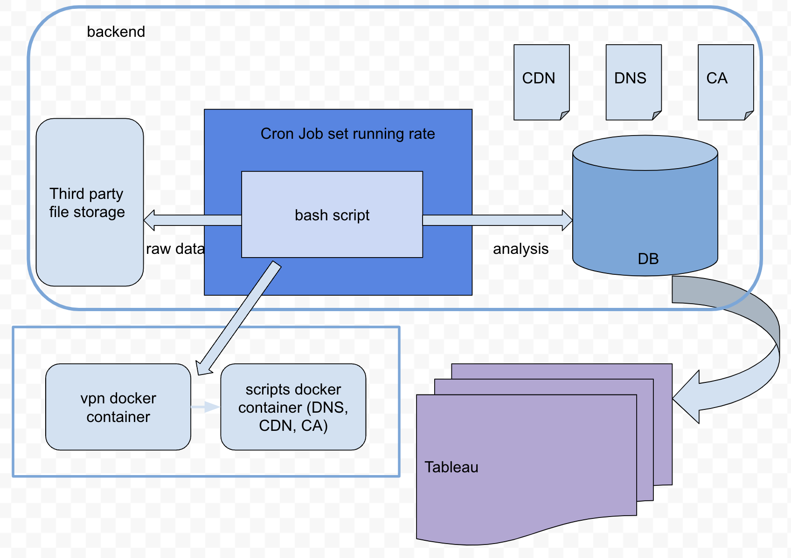

# World global index of Internet Consolidation
Our goal is to see how centralization varies across countries & regions

Here's the demo if you are interested: [https://public.tableau.com/app/profile/ying.zhang5411/viz/consolidation/menu?publish=yes](https://public.tableau.com/app/profile/ying.zhang5411/viz/consolidation/menu?publish=yes)

### *Run*

NordVpn docker image needs to be built on top of Ubuntu image. In other words, below bash file needs to run in linux/unix system 

Now we have a pipeline running Internet consolidation experiment among different countries for DNS, CA, CDN service using docker container. 

Country list is defined at `data/countryList.txt`

For DNS service, run `nohup ./bash_dns.sh >bash_dns.log 2>&1 &` 

For CA service, run `nohup ./bash_ca.sh >bash_ca.log 2>&1 &` 

For CDN service, run `nohup ./bash_cdn.sh >bash_cdn.log 2>&1 &`

Final results will be stored into database while internal resources will be uploaded to third party file storage system, e.g. GitHub in this case

Check process `ps -aux | grep bash_${service}.sh`

Use docker commands to check log or container status

### *Steps*

Here are the commands used in `bash_${service}.sh` file

**build docker script image**: `docker build --tag aqua/scripts_${service} . -f dockerfile.prober`

**run docker script image**: `docker run -it --dns=8.8.8.8 -e TZ=America/Chicago aqua/scripts_${service}`

### *VPN Container*

If you want run scripts in different country other than you currently locate in, you need to connect VPN container to scripts container

NodeVPN: `https://github.com/bubuntux/nordvpn`

**To build the VPN container, run:**  `docker build -f dockerfile.vpn -t aqua/vpn .`

**To run the VPN container, run:** `docker run -itd --rm --cap-add=NET_ADMIN --cap-add=NET_RAW aqua/vpn`

**To choose a specific country, add** `-e CONNECT=${COUNTRY_CODE}` to the previous command, eg, 

`docker run -itd --rm --name vpn_${COUNTRY_CODE} --cap-add=NET_ADMIN --cap-add=NET_RAW -e CONNECT=${COUNTRY_CODE} aqua/vpn`

**To connect another container to the vpn container, run:**

`docker run --rm -e COUNTRY=${COUNTRY_CODE} --net container: ${VPN_CONTAINER_NAME} ${OTHER_CONTAINER_NAME}`

### *Note*

For intermediate file storage, we use personal github token to store the file. You need to either put your own token or change the way of intermediate storage method

It's important to note that we collected data using NordVPN in 50 countries from 2021 to 2023. However, NordVPN discontinued its services in AE, CH, and IN, which explains the inconsistencies in the country mappings across different years.

### *Here's the design drawing*

